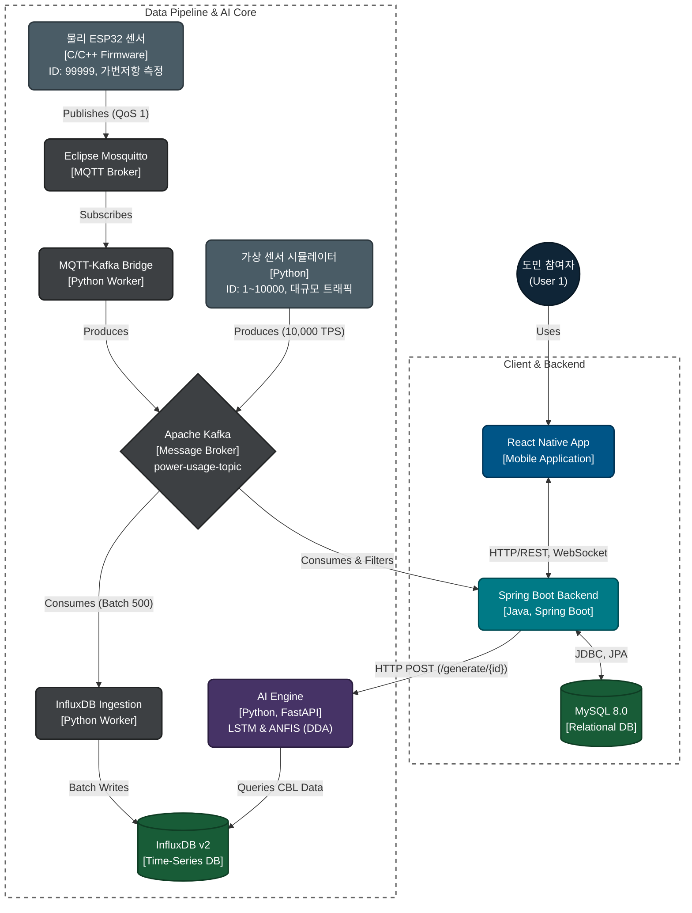

# 에지-AI 융합 분산 아키텍처 기반 강원도민 참여형 수요 반응 및 게이미피케이션 플랫폼 구축
## 우리집 전기 저금통 - AI & Data Pipeline
    

## 1. Project Overview
본 레포지토리는 강원특별자치도 2040 탄소중립 실현을 위한 **'에지-AI 융합 분산 아키텍처 기반 도민 참여형 수요반응(DR) 플랫폼'**의 [Data Pipeline & AI Core] 시스템입니다. 

**1만 가구 규모**의 스마트 미터(AMI) 데이터를 실시간으로 수집·가공하고, **LSTM 기반 전력 수요 예측**과 **ANFIS 기반 동적 난이도 조절(DDA)** 엔진을 결합하여 가계 에너지를 효율적으로 관리하는 End-to-End AI 서비스 파이프라인을 구현하였습니다. 본 아키텍처는 클라이언트/백엔드(Spring Boot, MySQL) 영역과 분리되어 있어 독립적인 확장(Scale-out) 가능합니다.

---

## 2. System Architecture 
본 시스템은 대규모 트래픽 완충과 시공간 데이터 무결성 확보를 위해 폴리글랏(Polyglot) 분산 아키텍처로 설계되었습니다.



## 3. Engineering Achievements
### 3.1. 물리-가상 투-트랙(Two-Track) 하이브리드 에지 아키텍처 구축
단순 시뮬레이션을 넘어, 실제 하드웨어 센서망과 대규모 가상 부하를 동시에 수용하는 하이브리드 Ingestion 레이어를 구현했습니다.

- [Physical Edge] 노이즈 필터링 보장: 실제 환경에 배치된 ESP32(ID: 99999) 보드는 내부적으로 10회 이동평균(Moving Average) 연산을 수행하여 아날로그 센서 노이즈를 제거한 뒤, MQTT(QoS 1)로 데이터를 안전하게 퍼블리싱합니다.

- [Virtual Edge] O(1) 이상치 사전 폐기: virtual_esp32_sensor.py는 10,000가구의 부하(10,000 TPS)를 발생시키기 직전, 물리적으로 불가능한 전력 수치(< 0.0kW 또는 > 15.0kW)를 에지 단에서 즉시 폐기(Drop)하여 중앙 Kafka 브로커의 네트워크 대역폭 낭비를 차단했습니다.

- [Backend] 식별자 정규화 및 트래픽 격리 방어막: 수만 건의 데이터가 혼재된 Kafka 토픽에서, Spring Boot 컨슈머는 단일 타겟 유저(User 1)로 데이터를 매핑 정규화하고 매핑되지 않은 더미 트래픽(ID: 2~10000)은 RDB 적재 전 즉각 드롭(Drop)시켜 데이터베이스 오염을 방어합니다.

### 3.2. 비동기 시계열 데이터 배치 적재 (Asynchronous Batch Ingestion)
1분 단위로 1만 가구에서 쏟아지는 방대한 데이터를 견디기 위해, 카프카 토픽(power-usage-topic)을 활용한 디커플링 구조를 설계하였습니다.

- 분산 Consumer Group: 파이썬 ingestion_api.py 워커는 백엔드 서버와 분리된 독립적인 컨슈머 그룹을 형성하여 메시지를 안전하게 구독합니다.

- 500-Batch 최적화: 매 건마다 DB I/O를 발생시키지 않고, batch_size=500, flush_interval=1000ms 옵션을 적용하여 InfluxDB에 대규모 Chunk 단위로 비동기 배치 쓰기를 수행함으로써 시계열 DB의 쓰기 성능을 개선하였습니다.

### 3.3. AI 코어 결함 허용성(Fault-Tolerance) 및 Cold-Start 방어
FastAPI 기반의 AI 엔진(ml_inference.py)은 운영 환경의 다양한 변수에 대응하는 방어적 프로그래밍이 적용되었습니다.

- API 계약 불일치 및 통신 장애 방어: MSA 통신 지연이나 404/500 에러 발생 시, 시스템이 붕괴하지 않고 즉각적으로 기본 미션(Easy 난이도, 50P)을 배정하는 Fallback 로직(createFallbackMission)을 동작시켜 프론트엔드 앱의 무중단 서비스를 보장합니다.

- KST 강제 동기화 및 콜드스타트 처리: Docker 컨테이너의 UTC 시간 오차를 방어하기 위해 ZoneInfo("Asia/Seoul")를 사용하여 주/야간 위상 변이 오류를 제거했으며, 데이터가 부족한 신규 유저 유입 시 기본 임베딩(idx=0)으로 안전하게 추론을 수행합니다.

### 3.4. 듀얼-트랙 데이터 브로드캐스팅 및 다운샘플링 규약
프론트엔드 UI 렌더링 한계를 방어하고, 실시간 반응성을 높이기 위해 데이터의 목적에 따라 전송 규약을 분리했습니다.

- 실시간 1초 틱 스트리밍: 현재 사용량(도넛 차트 등)은 Kafka 소비와 동시에 1초 주기 스로틀링을 거쳐 WebSocket으로 실시간 브로드캐스트됩니다.

- 24슬롯 AI 예측 다운샘플링: LSTM이 예측한 15분 단위(96슬롯) 결과물은 FastAPI에서 HTTP REST 요청 반환 시 1시간 단위(24슬롯)로 자동 다운샘플링되어 백엔드 프레임 드랍을 막고 규약을 정규화합니다.

## 4. 필수 데이터 세팅 안내 
본 시스템의 인공지능 학습 및 시뮬레이션을 위한 데이터셋은 프랑스 파리 전역 데이터와 강원 원주시 전력 패턴을 융합하여 합성되었습니다. (볼륨: 1만 가구, 약 4.3억 건)

- 원시 데이터셋 (Google Drive): [다운로드 링크](https://drive.google.com/file/d/1FAhj9jCu8ryB4thFB-vR_AtOtgGcFJkq/view?usp=drive_link)  
  - 압축 해제 후 프로젝트 최상단의 data/ 디렉터리에 배치합니다.

- 학습 완료 모델 및 스케일러 (Google Drive): [다운로드 링크](https://drive.google.com/drive/folders/1qet8-LPyzRVhxsRTOCw0b9KRusf486kN?usp=drive_link)
  - khnp_dr_best_model.pth, scaler.pkl, user_to_idx.pkl 파일을 ai-data-pipeline/ai_core/saved_models/ 경로에 덮어쓰기 합니다.


## 5. 실행 가이드 
마이크로서비스 의존성 충돌을 방지하기 위해 아래의 순서를 준수하여 5개의 터미널에서 각각 기동합니다.

### [Terminal 1] Phase 1: 인프라 컨테이너 가동 (Kafka, InfluxDB 등)
```bash
cd CAPSTONE2026
docker-compose up -d
```

### [Terminal 2] Phase 2: 시공간 동기화 데이터 합성 (최초 1회만 실행)
```bash
cd CAPSTONE2026/ai-data-pipeline/simulators
python generate_dr_data.py
```

### [Terminal 3] Phase 3: AI 엔진 (FastAPI) Serving 가동
```bash
cd CAPSTONE2026/ai-data-pipeline
uvicorn api_serving.main:app --host 0.0.0.0 --port 8000
```

### [Terminal 4] Phase 4: 비동기 시계열 적재 워커 가동
```bash
cd CAPSTONE2026/ai-data-pipeline/workers
python ingestion_api.py
```

### [Terminal 5] Phase 5: 물리-가상 하이브리드 트래픽 발사 (10,000 TPS)
```bash
cd CAPSTONE2026/ai-data-pipeline/simulators
python virtual_esp32_sensor.py
```
### (※ 물리 ESP32 보드는 별도 전원 인가 시 자동 연동됨)


## 6. Directory Structure
```
CAPSTONE2026/
├── ai-data-pipeline/
│   ├── ai_core/                        # [AI 모델 훈련 및 코어 로직]
│   │   ├── saved_models/               # 최적화된 LSTM 가중치 및 스케일러 보관
│   │   ├── anfis_engine.py             # 신경망-퍼지 결합 DDA(동적 난이도) 엔진
│   │   ├── model.py                    # PyTorch 기반 LSTM 네트워크 정의
│   │   └── train.py                    # Cloud GPU 분산 학습 파이프라인
│   │
│   ├── api_serving/                    # [FastAPI AI 서빙 계층]
│   │   ├── main.py                     # API 서버 진입점
│   │   ├── ml_inference.py             # LSTM/ANFIS 추론 래퍼 (KST 동기화 및 Cold-Start 방어)
│   │   └── router.py                   # Spring Boot 연동 REST 엔드포인트
│   │
│   ├── data/                           # [로컬 데이터 보관소] 1만 가구 융합 시계열 데이터
│   │
│   ├── edge_firmware/                  # [물리 에지 노드 펌웨어]
│   │   └── esp32_mqtt_client.ino       # 10회 이동평균 필터링 및 JSON 페이로드 MQTT 통신 C++ 코드
│   │
│   ├── simulators/                     # [가상 센서 발생기]
│   │   ├── generate_dr_data.py         # Time-Warp 시공간 동기화 데이터 정렬기
│   │   └── virtual_esp32_sensor.py     # 1만 가구 동시 부하 및 Edge O(1) 필터링 스트리밍 로직
│   │
│   └── workers/                        # [메시지 브릿지 및 적재 워커]
│       ├── ingestion_api.py            # InfluxDB 500-Batch 비동기 적재 워커
│       └── mqtt_ingestion_worker.py    # MQTT ➔ Kafka 브릿지 및 페이로드 스키마 정규화
│
├── docker-compose.yml                  # 인프라(Kafka, InfluxDB) 컨테이너 명세
└── README.md                           # 현재 문서
```