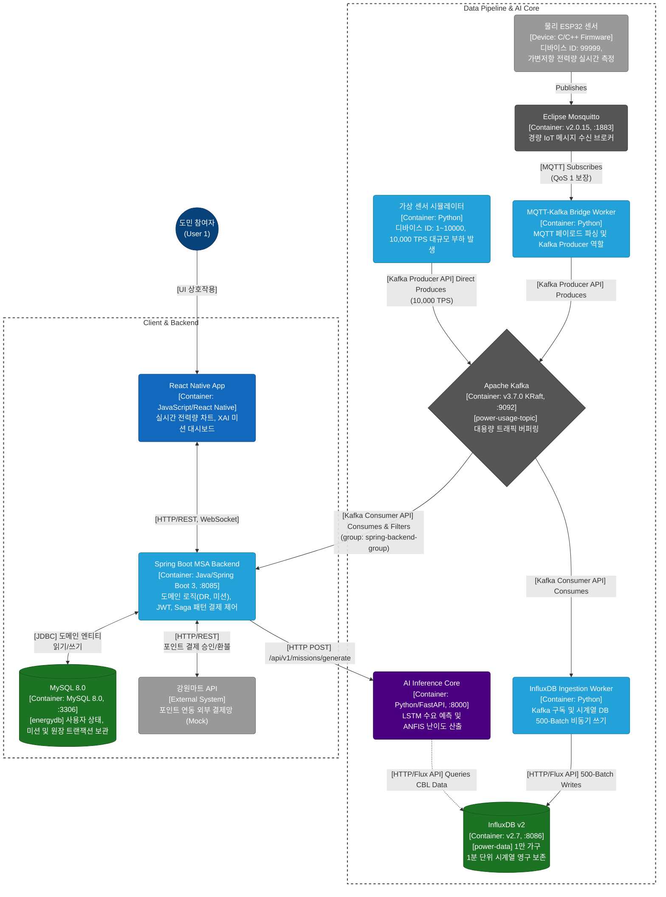

# 에지-AI 융합 분산 아키텍처 기반 도민 참여형 수요 반응(DR) 및 맞춤형 보상 플랫폼 구축
## 우리집 전기 저금통 - AI & Data Pipeline
    

---
## 1. Project Overview
본 레포지토리는 강원특별자치도 2040 탄소중립 실현을 위한 **도민 참여형 수요반응(DR) 플랫폼**의 데이터 파이프라인 및 인공지능 코어 저장소입니다. **1만 가구 규모**의 가상 스마트 미터 데이터를 실시간으로 수집·가공합니다. **인공지능(LSTM)이 전력 수요를 예측**합니다. **또 다른 인공지능(ANFIS)이 사용자에게 알맞은 미션 난이도를 실시간으로 부여**합니다. 이 두 엔진을 결합하고, 대규모 트래픽을 버티는 구조를 통해 가정에서부터 에너지 절약을 유도합니다. 

---
## 2. System Architecture 
시스템은 **마이크로 서비스 아키텍처 기반**으로 설계되었습니다. 시스템을 독립된 서비스 단위로 쪼개어 설계하고 구현하였습니다.
- MSA는 **유연한 확장성**을 가집니다. 모놀리식 구조와 달리, 부하가 집중되는 특정 컴포넌트만 선택적으로 늘릴 수 있습니다.
- **기술 선택의 자유**가 있습니다. MSA 환경에서는 각 서비스가 하나의 특화된 기능만 집중해서 수행합니다. 
- **고가용성**을 가집니다. 단일 구조에서는 작은 부품 하나가 고장 나면 전체 프로그램이 멈출 위험이 큽니다. 하지만 MSA는 서로 분리되어 있으므로 한 곳의 오류가 다른 곳으로 번지지 않습니다.



## 3. Engineering Achievements
### 3.1. 실제 센서와 가상 트래픽의 하이브리드 에지 아키텍처 구축
실제 센서 기기의 트래픽과 가상 기기의 1만 가구의 트래픽을 동시에 수용하는 데이터 수집 환경을 구축했습니다.

- 물리 센서의 노이즈 제거: 실제 환경에 배치된 물리 센서(ESP32)는 최근 10회 측정값을 평균 내어 기계적 노이즈를 제거합니다. 이후 MQTT 통신으로 데이터를 전달합니다.

- 가상 센서 이상치 사전 폐기: 가상 센서는 1초에 1만 건의 부하를 발생시킵니다. 이때 물리적으로 불가능한 비정상적인 전력 수치는 단말기 선에서 먼저 폐기합니다. 중앙 Kafka 브로커 네트워크 대역폭 낭비를 막습니다.

- 트래픽 격리 및 방어: 메인 서버(Spring Boot)는 수만 건의 데이터 중 타겟 유저(User 1)의 데이터만 정확히 분류합니다. 분류되지 않은 데이터(ID: 2~10000)는 RDB 적재 전 폐기하여 데이터베이스 자원을 절약합니다.
---

### 3.2. 카프카(Apache Kafka) 기반 대용량 비동기 적재
1분 단위로 1만 가구에서 쏟아지는 방대한 데이터를 견디기 위해, 카프카(Kafka)를 활용한 비동기 구조를 설계했습니다.
- 독립적 워커 그룹: 파이썬 데이터 적재 워커는 메인 서버와 분리된 독립적 그룹을 형성하여 자신의 소비량에 맞게 데이터를 가져옵니다.
- 배치 단위 적재: 데이터가 들어올 때마다 하나씩 데이터베이스에 쓰지 않고, 500개씩 묶어서 한 번에 저장합니다. 이를 통해 시계열 데이터베이스(InfluxDB)의 쓰기 속도와 성능을 개선했습니다.
---

### 3.3. 인공지능 시스템의 결함 방어 
인공지능 엔진은 서버가 다운되거나 데이터가 부족한 상황에서도 멈추지 않도록 방어적으로 설계되었습니다.

- 통신 장애 방어 로직: 내부 통신망에 지연이나 장애가 발생해도 시스템이 멈추지 않습니다. 즉시 기본 미션(Easy 난이도, 50P)을 배정하는 예비 로직을 가동하여 사용자에게 무중단 서비스를 제공합니다.
- 신규 유저용 방어: 가입 직후 전력 사용 데이터가 부족한 신규 유저가 접속해도 에러가 발생하지 않습니다. 사전에 준비된 기본 기준값을 사용하여 안전하게 예측 곡선을 그려냅니다.
---

### 3.4. 모바일 화면 최적화를 위한 데이터 규약 분리
스마트폰 화면이 부하로 끊기는 현상을 막기 위해 데이터 전송 목적에 따라 규칙을 분리했습니다.
- 1초 단위 실시간 통신: 현재 전력 사용량은 서버가 수신하는 즉시 웹소켓 통신을 통해 1초 단위로 전송되고, 버퍼에 모아 1분 단위로 스마트폰에 그려집니다.
- 인공지능 예측 결과 압축: 인공지능이 15분 단위로 촘촘하게 예측한 결과물은 1시간 단위로 압축하여 모바일 앱으로 보냅니다. 이를 통해 앱의 과도한 연산을 막고 부드러운 화면 전환을 보장합니다.
---

## 4. 필수 데이터 세팅 안내 
본 시스템의 인공지능 학습 및 시뮬레이션을 위한 데이터셋은 원주시 전역 데이터와 프랑스 파리 근교 지역 1분 단위 소비 패턴을 융합하여 합성되었습니다. (볼륨: 1만 가구, 약 4.3억 건)

- 원시 데이터셋 (Google Drive): [다운로드 링크](https://drive.google.com/file/d/1FAhj9jCu8ryB4thFB-vR_AtOtgGcFJkq/view?usp=drive_link)  
    - 저장 경로: 프로젝트 최상단의 data/ 디렉터리에 배치합니다.

- 학습 완료 모델 및 스케일러 (Google Drive): [다운로드 링크](https://drive.google.com/drive/folders/1qet8-LPyzRVhxsRTOCw0b9KRusf486kN?usp=drive_link)
    - 저장 경로: ai-data-pipeline/ai_core/saved_models/ 경로에 덮어쓰기 합니다.
    - 대상 파일: khnp_dr_best_model.pth, scaler.pkl, user_to_idx.pkl (총 3개의 파일)
---

## 5. AWS EC2 클라우드 실행 및 운영 가이드 
  본 프로젝트는 MSA(Microservices Architecture)로 구성어 세분화된 인프라를 가지고 있습니다. 
  운영 편의성과 배포 자동화를 위해 **단일 통합 제어 스크립트(Master Shell Script)**를 자체 제작하여 제공합니다. 

---
### 5.1. MSA 인프라 일괄 시동 (`start_msa.sh`)
  이 스크립트는 DB 컨테이너 부팅 ➔ AI 코어 ➔ 비동기 워커 ➔ Spring Boot 메인 서버 ➔ 트래픽 시뮬레이터 순으로, 각 컴포넌트의 의존성과 부팅 대기 시간(Sleep)을 고려하여 시스템을 안전하게 기동합니다.

```bash
# 프로젝트 최상위 경로에서 실행
./start_msa.sh
```
---
### 5.2. MSA 인프라 일괄 종료 (stop_msa.sh)
  메모리 누수를 방지하고 할당받은 포트를 안전하게 반환하기 위해, 백그라운드에서 동작 중인 Python 데몬, Java 데몬, 그리고 Gradle 빌드 보조 프로세스를 추적하여 한 번에 종료합니다.

```bash
./stop_msa.sh
```
---

### 5.3. 시스템 상태 통합 모니터링 (status_msa.sh)
  여러 포트와 백그라운드 데몬으로 흩어진 MSA 컴포넌트들의 동작 여부(PID, Port, Docker Status)를 한 번에 스캔하여 확인합니다.
```bash
./status_msa.sh
```
---

### 5.4. 컴포넌트별 개별 수동 제어 및 로그 확인
통합 스크립트를 사용하지 않고 특정 컴포넌트만 디버깅하거나 재시작해야 할 경우, 아래의 개별 명령어를 사용합니다. <br>
(각 단계는 독립된 터미널 세션에서 실행을 권장합니다.)

### [Phase 1] 인프라 컨테이너 가동 (MySQL, InfluxDB 등)
```bash
cd ~/data_pipeline_ai/ai-data-pipeline
docker-compose up -d

# [상태 확인] 
docker ps
```
---
### [Phase 2] 시공간 동기화 데이터 합성 (최초 1회만 실행)
부하 산출을 위한 시드 데이터를 생성합니다.
클라우드에 이미 관련 데이터를 구축해두었으므로, 실행하실 필요 없습니다.
```bash
cd ~/data_pipeline_ai/ai-data-pipeline/simulators
python generate_dr_data.py
```
---
### [Phase 3] AI 엔진 (FastAPI) Serving 데몬 가동
```bash
cd ~/data_pipeline_ai/ai-data-pipeline
source .venv/bin/activate
nohup python -m uvicorn api_serving.main:app --host 0.0.0.0 --port 8000 > fastapi.log 2>&1 &

# [Log Monitor]
tail -f fastapi.log
```
---
### [Phase 4] 비동기 시계열 적재 워커 데몬 가동
```bash
cd ~/data_pipeline_ai/ai-data-pipeline/workers
nohup python ingestion_api.py > ingestion.log 2>&1 &
nohup python mqtt_ingestion_worker.py > mqtt_worker.log 2>&1 &

# [Log Monitor]
tail -f ingestion.log
tail -f mqtt_worker.log
```
---
### [Phase 5] 물리-가상 하이브리드 트래픽 전송 (10,000 TPS)
```bash
cd ~/data_pipeline_ai/ai-data-pipeline/simulators
nohup python virtual_esp32_sensor.py > sensor_traffic.log 2>&1 &

# [Log Monitor] 
tail -f sensor_traffic.log
```
(※ 고유 ID(99999)를 가진 물리 ESP32 보드는 별도 전원 인가 시 클라우드 MQTT 브로커로 자동 연동됩니다.)

---
### [Phase 6] Spring Boot 메인 백엔드 데몬 가동
모바일 클라이언트(App)와 직접 통신하며 결제, 인증, 웹소켓 관리를 총괄하는 비즈니스 계층을 8085 포트로 기동합니다.
``` bash
cd ~/backend_service_client/energy-api
nohup ./gradlew bootRun > springboot.log 2>&1 &

# [Log Monitor] 
tail -f springboot.log
```
---
### [Troubleshooting] 클라우드 데몬 프로세스 수동 종료 가이드
메모리 누수 방지를 위해 현재 실행 중인 모든 데몬 프로세스를 안전하게 종료하는 명령어입니다.

```bash
# 1. 파이썬 기반 AI 코어 및 데이터 워커 일괄 종료
pkill -f python

# 2. 자바 기반 Spring Boot 백엔드 종료
pkill -f bootRun

# 3. 백그라운드에 숨은 빌드 보조 프로그램(Gradle Daemon) 종료
cd ~/backend_service_client/energy-api
./gradlew --stop

# 4. 정상 종료 여부 확인
ps -ef | grep python
ps -ef | grep java
```
---
## 6. Directory Structure
```
CAPSTONE2026/
├── ai-data-pipeline/
│   ├── ai_core/                        # [AI 모델 훈련 및 코어 로직]
│   │   ├── saved_models/               # 학습 완료된 인공지능(LSTM) 두뇌 파일 보관
│   │   ├── anfis_engine.py             # 맞춤형 미션을 산출하는 퍼지 엔진
│   │   ├── data_loader.py              # 시계열 DB에서 과거 기록을 가져와 인공지능 학습용으로 변환
│   │   ├── db_client.py                # 인공지능 예측에 필요한 최근 24시간의 전력 기록 조회
│   │   ├── model.py                    # PyTorch 기반 LSTM 네트워크 구조 정의
│   │   └── train.py                    # Cloud GPU 인공지능 학습 파일
│   │
│   ├── api_serving/                    # [FastAPI AI 서빙 계층]
│   │   ├── main.py                     # FastAPI 서버 진입점
│   │   ├── ml_inference.py             # LSTM/ANFIS 추론 래퍼 
│   │   ├── router.py                   # Spring Boot 연동 REST 엔드포인트
│   │   ├── schemas.py                  # 메인 서버와 통신할 때 주고받는 데이터의 응답 규격 정의
│   │   └── services.py                 # 전력 예측과 미션 생성 엔진을 연결하는 서비스 로직
│   │
│   ├── data/                           # [로컬 데이터 보관소] 1만 가구 융합 시계열 데이터
│   │
│   ├── edge_firmware/                  # [물리 에지 노드 펌웨어]
│   │   └── esp32_mqtt_client.ino       # 10회 이동평균 필터링 및 JSON 페이로드 MQTT 통신 C++ 코드
│   │
│   ├── notebooks/                      # [코랩용 노트북 파일]
│   │   └── DR_24H_Model_Training.ipynb # Google Colab GPU 활용하여 모델 학습
│   │
│   ├── simulators/                     # [가상 센서 발생기]
│   │   ├── bulk_ingestion.py           # 인공지능 초기 부팅을 위해 1만 가구의 과거 데이터를 데이터베이스에 한 번에 쏟아붓는 파일
│   │   ├── generate_dr_data.py         # Time-Warp 시공간 동기화 데이터 정렬기
│   │   └── virtual_esp32_sensor.py     # 1만 가구 동시 부하 및 즉각적인 필터링 스트리밍 로직
│   │
│   ├── stress_test/
│   │   ├── demo_live_sensor.py         # 물리 센서를 흉내 내어 현실적인 1가구 전력 소비 데이터를 실시간으로 만들어내는 시연용 파일
│   │   └── stress_test_simulator.py    # 초당 1만 건의 트래픽을 발생시켜 서버가 200ms 이내에 응답하는지 검증하는 테스트 파일
│   │
│   └── workers/                        # [메시지 브릿지 및 적재 워커]
│       ├── ingestion_api.py            # InfluxDB 500-Batch 비동기 적재 워커
│       └── mqtt_ingestion_worker.py    # MQTT ➔ Kafka 브릿지 및 페이로드 스키마 정규화
│
├── start_msa.sh                        # AWS Ununtu 환경 시스템 일괄 기동 스크립트
├── status_msa.sh                       # AWS Ununtu 환경 MSA 컴포넌트 동작 여부 확인 스크립트
├── stop_msa.sh                         # AWS Ununtu 환경 시스템 일괄 종료 스크립트
│
├── docker-compose.yml                  # 인프라(Kafka, InfluxDB) 컨테이너 명세
└── README.md                           # 현재 문서                      
```